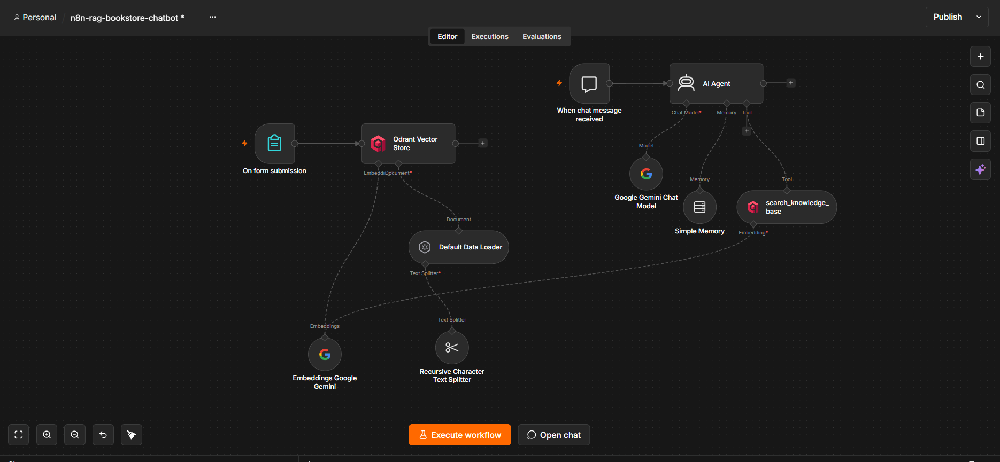

# 📚 n8n RAG Bookstore AI Assistant (Qdrant + Gemini Embedding)

یک چتبات هوشمند پشتیبانی و راهنمای مشتریان بر پایه تکنولوژی **RAG (Retrieval-Augmented Generation)** در **n8n**. 
این پروژه شامل دو بخش اصلی است:
1. **Ingestion Pipeline:** دریافت فایل‌های کاتالوگ PDF از طریق فرم آنلاین، تکه‌تکه‌سازی (Chunking)، تبدیل به Embedding با مدل Gemini و ذخیره درون پایگاه داده برداری **Qdrant Vector Store**.
2. **Conversational RAG Agent:** ایجنت پاسخگوی چت که با استفاده از ابزار جستجوی دیتابیس برداری (`search_knowledge_base`)، حافظه کوتاه‌مدت نشست‌ها (`Buffer Memory`) و مدل زبانی Gemini به سوالات مشتریان درباره کاتالوگ، موجودی، خلاصه کتاب‌ها و قیمت‌ها با دقت بالا پاسخ می‌دهد.

---

## 🎬 پیش‌نمایش و دمو (Demo)

### 📹 ویدیو دمو (Video Preview)
> 💡 دموی تصویری: چت هوشمند با دستیار را در لینک زیر ببینید:
> 

https://github.com/user-attachments/assets/da43d3d1-f444-4f66-96e5-31a17831819c

---

### 📸 اسکرین‌شات جریان کاری (Workflow Canvas)

---

## 🌟 ویژگی‌های کلیدی پروژه (Key Features)

* **📄 آپلود آنلاین کاتالوگ (PDF Ingestion):** دارای فرم اختصاصی n8n جهت دریافت فایل‌های PDF و پردازش خودکار آن‌ها.
* **✂️ تکه‌تکه‌سازی متون (Text Splitting):** استفاده از `Recursive Character Text Splitter` با تنظیمات مناسب Chunk Size برای حفظ پیوستگی مفاهیم.
* **🧠 تبدیل برداری (Gemini Embeddings):** تبدیل متن به بردار (Vector) با استفاده از مدل `gemini-embedding-2`.
* **🗄️ پایگاه داده برداری (Qdrant Vector DB):** ذخیره و بازیابی بسیار سریع متون بر اساس شباهت معنایی (Semantic Search).
* **🔍 جستجوی RAG صریح (Strict Grounding):** محدود بودن ایجنت به پاسخ‌دهی تنها بر اساس دیتابیس واقعی، بدون داشتن توهم (Hallucination) یا ارائه‌ اطلاعات نادرست.
* **💬 مدیریت حافظه چت (Session Memory):** نگهداری تاریخچه گفتگوی کاربر با استفاده از `Memory Buffer Window`.

---

## 🛠️ تکنولوژی‌ها و سرویس‌های استفاده‌شده

| فناوری / ابزار | نقش در معماری RAG |
| :--- | :--- |
| **n8n** | مدیریت ارکستراسیون پردازش داده و ایجنت هوش مصنوعی |
| **Qdrant Vector Store** | پایگاه داده برداری جهت ذخیره و جستجوی شباهت متون |
| **Google Gemini Embedding** | مدل تبدیل متون سند PDF به بردارهای ریاضی |
| **Google Gemini Chat Model** | مدل زبانی اصلی برای درک سوالات و تولید پاسخ |
| **LangChain Agent** | ایجنت تصمیم‌گیرنده برای فراخوانی ابزار دیتابیس برداری |

---

## 🚀 نحوه راه‌اندازی (Setup & Usage)

1. **دانلود فایل ورکفلو:** فایل `n8n-rag-bookstore-chatbot.json` را از مخزن دانلود کنید.
2. **Import در n8n:** فایل را درون بوم (Canvas) برنامه n8n بارگذاری کنید.
3. **تنظیم کلیدهای دسترسی (Credentials):**
   * **Qdrant API:** آدرس Cluster و API Key دیتابیس Qdrant خود را ست کنید.
   * **Google Gemini API:** کلید API مربوط به Google AI Studio را وارد کنید.
4. **تزریق داده (Ingestion):**
   * فرم اختصاصی (`On form submission`) را اجرا کرده و فایل PDF کاتالوگ کتاب‌ها را آپلود کنید تا درون Qdrant ذخیره شود.
5. **شروع چت:** نود `chatTrigger` را فعال کرده و شروع به پرسش درباره کاتالوگ کتاب‌ها کنید!

